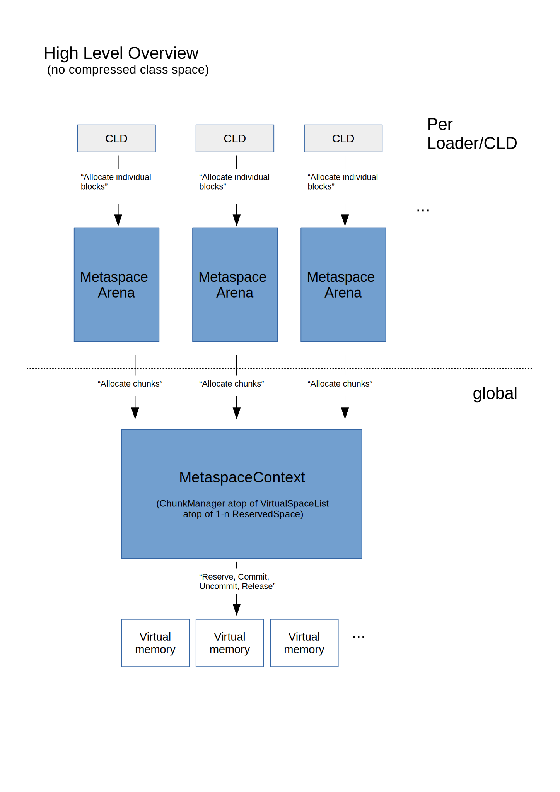
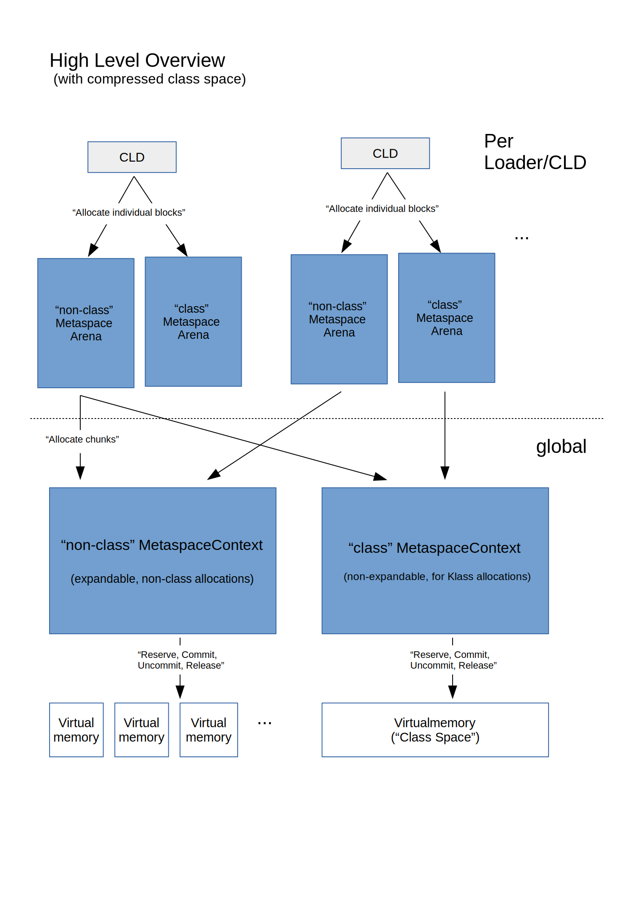
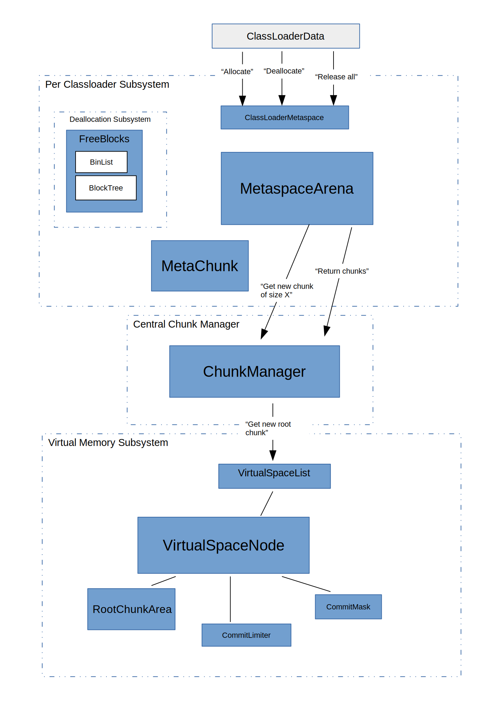
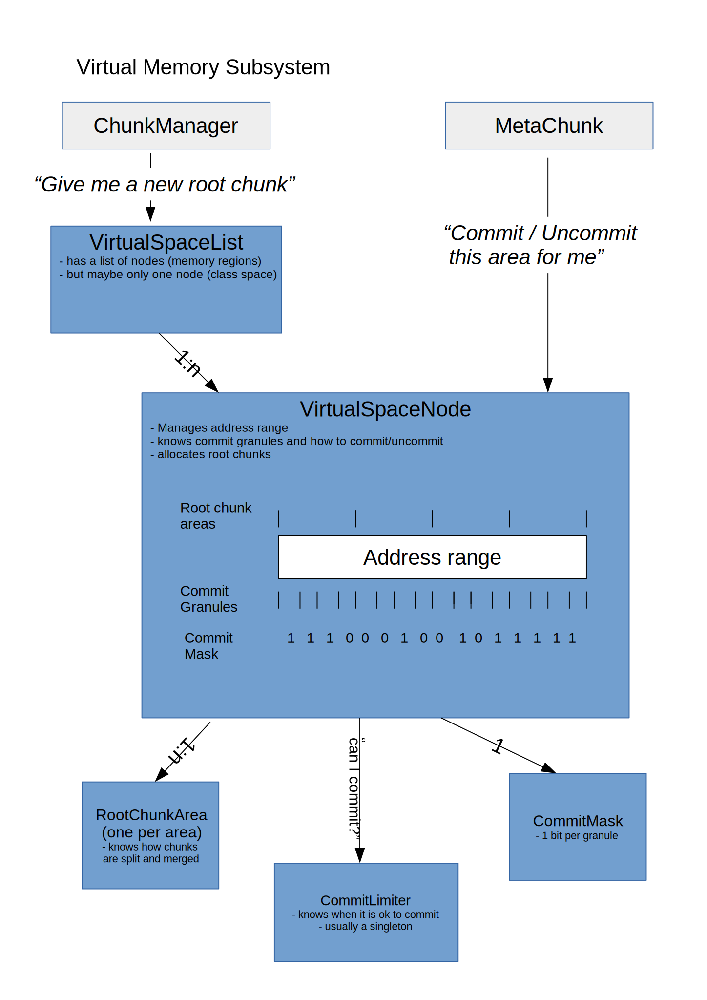
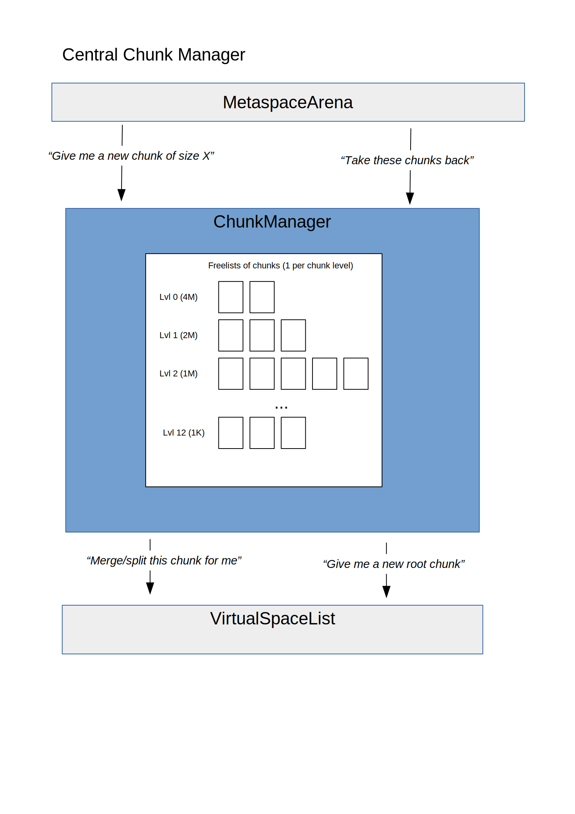
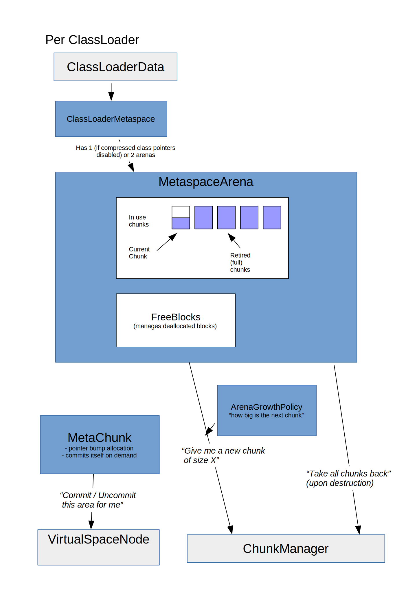
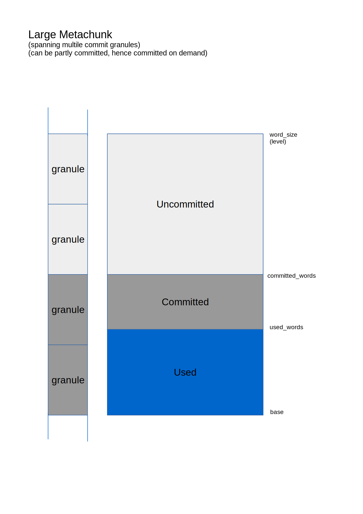
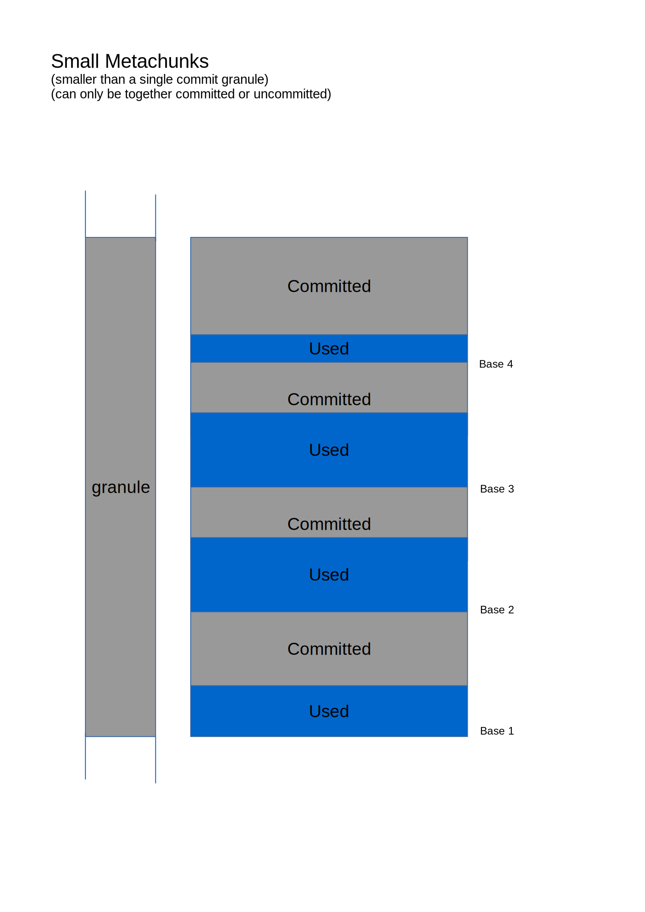
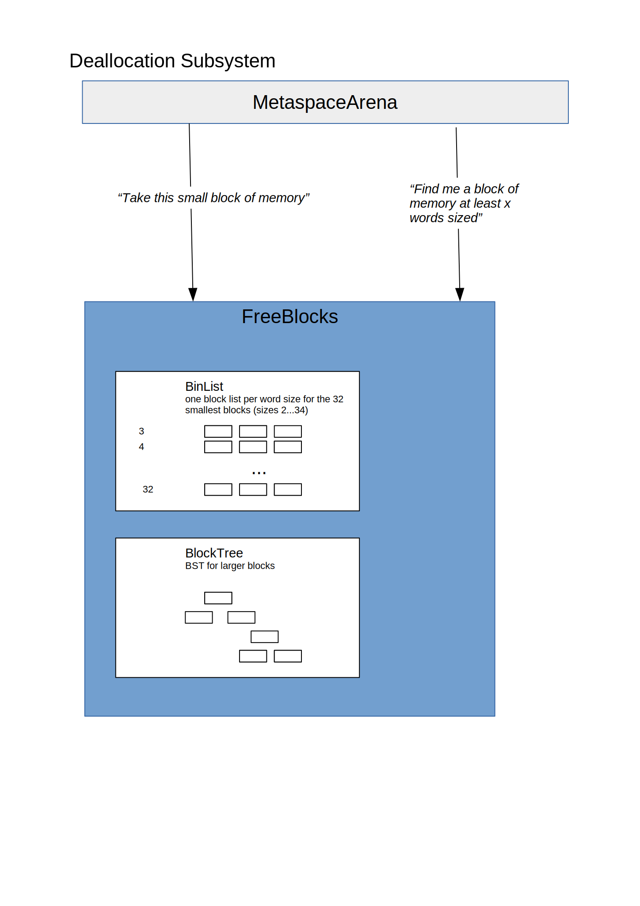

<!-- TOC -->

- [1. Preface](#1-preface)
    - [1.1. High Level Overview](#11-high-level-overview)
    - [1.2. Core Concepts](#12-core-concepts)
        - [1.2.1. Commit Granules](#121-commit-granules)
        - [1.2.2. Metachunks and the Buddy Style Allocator](#122-metachunks-and-the-buddy-style-allocator)
            - [1.2.2.1. Merging chunks](#1221-merging-chunks)
            - [1.2.2.2. Splitting chunks](#1222-splitting-chunks)
    - [1.3 How it all looks in memory](#13-how-it-all-looks-in-memory)
    - [1.4. Outside interface](#14-outside-interface)
- [2. Subsystems](#2-subsystems)
    - [2.1. The Virtual Memory Subsystem](#21-the-virtual-memory-subsystem)
        - [2.1.1. Essential operations](#211-essential-operations)
        - [2.1.2. Other operations](#212-other-operations)
        - [2.1.3. Classes](#213-classes)
            - [2.1.3.1. class VirtualSpaceList](#2131-class-virtualspacelist)
            - [2.1.3.2. class VirtualSpaceNode](#2132-class-virtualspacenode)
            - [2.1.3.3. class CommitMask](#2133-class-commitmask)
            - [2.1.3.4. class RootChunkArea and class RootChunkAreaLUT](#2134-class-rootchunkarea-and-class-rootchunkarealut)
            - [2.1.3.5. class CommitLimiter](#2135-class-commitlimiter)
    - [2.2. The Central Chunk Manager Subsystem](#22-the-central-chunk-manager-subsystem)
        - [2.2.1. Basic operations](#221-basic-operations)
    - [2.3. Classloader-local Subsystem](#23-classloader-local-subsystem)
        - [2.3.1. Basic operations](#231-basic-operations)
        - [2.3.2. Classes](#232-classes)
            - [2.3.2.1. class Metachunk](#2321-class-metachunk)
                - [2.3.2.1.1. Metachunk Memory](#23211-metachunk-memory)
                - [2.3.2.1.2. Metachunk::allocate()](#23212-metachunkallocate)
            - [2.3.2.2. class MetaspaceArena](#2322-class-metaspacearena)
                - [2.3.2.2.1. MetaspaceArena::allocate()](#23221-metaspacearenaallocate)
                - [2.3.2.2.2. Retiring chunks](#23222-retiring-chunks)
            - [2.3.2.3. class ClassLoaderMetaspace](#2323-class-classloadermetaspace)
                - [2.3.2.3.1. class ArenaGrowthPolicy](#23231-class-arenagrowthpolicy)
    - [2.4. Deallocation subsystem](#24-deallocation-subsystem)
        - [2.4.1. Classes](#241-classes)
    - [2.5. Auxiliary code](#25-auxiliary-code)
        - [2.5.1. class ChunkHeaderPool](#251-class-chunkheaderpool)
        - [2.5.2. Counters](#252-counters)
        - [2.5.3. MetachunkList and MetachunkListVector](#253-metachunklist-and-metachunklistvector)
        - [2.5.4. Allocation guards](#254-allocation-guards)
    - [3. Locking and concurrency](#3-locking-and-concurrency)
    - [4. Tests](#4-tests)
        - [4.1 Gtests](#41-gtests)
        - [4.2 jtreg tests](#42-jtreg-tests)
    - [5. Further information](#5-further-information)

<!-- /TOC -->


# 1. Preface

_(not as complicated as it looks!)_

JEP 387 "Elastic Metaspace" is the rewrite of the Metaspace allocator with the following goals:

- to reduce memory consumption
- to return unused memory back to the OS after class unloading
- to have a clean and maintainable implementation

The corresponding proposal is [JEP 387](https://openjdk.java.net/jeps/387).

This document is both a review guide and a short architectural description of this project.


## 1.1. High Level Overview

Metaspace is used to manage memory for class metadata. Class metadata are allocated when classes are loaded (mostly). Their lifetime is scoped to that of the loading classloader (mostly). When a loader gets collected all class metadata it accumulated get released back to the metaspace in one go. This removes the need to track individual allocations for the purpose of freeing them - we have a bulk delete scenario.

Therefore metaspace is a [arena- or region-based allocator](https://en.wikipedia.org/wiki/Region-based_memory_management). It is optimized for fast, memory efficient allocation of native memory at the cost of not being able to (easily) delete arbitrary blocks.

__Seen from a very high level:__

A CLD owns a `MetaspaceArena`. From that arena it allocates memory for class metadata and other purposes via pointer bump. As it is used up the arena grows dynamically (in semi-coarse steps, whose size is one of the tuning challenges).

When the CLD is deleted, the arena gets deleted and its memory returned to the metaspace.

Globally there exist a `MetaspaceContext`: the metaspace context manages the underlying memory at the OS level. To arenas it offers a coarse-grained allocation API, where memory is handed out in the form of chunks. It also keeps a freelist of said chunks which had been released from deceased arenas.

Only one global context exists if compressed class pointers are disabled and we have no compressed class space:



If compressed class pointers are enabled, we keep class space allocations separate from non-class space allocations. Hence we have two global metaspace context instances: one holding allocations of Klass structures (the "compressed class space"), one holding everything else (the "non-class" metaspace). Mirroring that duality, each CLD now owns two arenas as well:




## 1.2. Core Concepts

### 1.2.1. Commit Granules

One of the key points of _Elastic_ Metaspace is elasticity, the ability to uncommit unneeded memory, and commit memory only on demand. So in contrast to the old implementation, we do not have a contiguous committed region but committed and uncommitted areas may interleave.

This is done by introducing "commit granules". These are homogenously sized memory units, power-of-two sized, and the metaspace address range is split up into these granules. Commit granules are the basic unit of committing and uncommitting memory in Metaspace. 

While commit granules may in theory be as small as a single page, in practice they are larger (defaulting to 64K).

The smaller a commit granule is, the more likely it is to be unoccupied and eligible for uncommitting. But at the same time, uncommitting very small areas will increase the number of VMA's of the VM process. Therefore commit granule size is a compromise. The default size is 64K with `-XX:MetaspaceReclaimStrategy=balanced`. Switching to `-XX:MetaspaceReclaimStrategy=aggressive` switches granule size to 16K (4 pages on most platforms). The latter gives better results in scenarios with heavy usage of anonymous classes, e.g. reflection proxies.


### 1.2.2. Metachunks and the Buddy Style Allocator

Metaspace arenas are growable. Internally they are lists of variable-sized memory chunks, the `Metachunk`s. These are the unit of allocation from the lower levels. Arenas obtain these chunks from their respective metaspace context and return all chunks back to the context when they die.

Chunks are variable power-of-two sized. Largest size is 4M ("Root Chunk"). Smallest size is 1K.

Chunks are managed by a [buddy allocator](https://en.wikipedia.org/wiki/Buddy_memory_allocation). A buddy allocator is a simple old efficient algorithm useful to keep fragmentation at bay, at the cost of limiting the size of managed areas to power of two units. This restriction does not matter for Metaspace since the chunks are not the ultimate unit of allocation, just an intermediate.

In code (see `chunklevel.hpp`), chunk size is given as "chunk level" (`typedef .. chklvl_t`). A root chunk - the largest chunk there is - has chunk level 0. The smallest chunk has chunk level 13. Helper functions and constants to work with chunk level can be found at chunk_level.hpp.

#### 1.2.2.1. Merging chunks

A chunk is always part of a pair of chunks, unless the chunk is a root chunk. We call a chunk a "leader" if it is the first chunk (lower address) of the pair.

```
+-------------------+-------------------+
| Leader            | Follower          |
+-------------------+-------------------+
```

A free chunk can be merged with its buddy if that buddy is free and unsplit (which is synonymous if buddy style rules are followed). That process can be repeated:

```
+---------+---------+---------+---------+
|    A    |    B    |    C    |    D    |
+---------+---------+---------+---------+
                    |
                    v
+-------------------+-------------------+
|         A`        |         B`        |
+-------------------+-------------------+
                    |
                    v
+-------------------+-------------------+
|                   A``                 |
+-------------------+-------------------+
```

If the buddy is not free, or split (in which case one of the splinters will not be free), we cannot merge. In this example, B cannot merge with its buddy since it is splintered, and it is splintered since one of its splinters, d2, is not free yet.

```
+-------------------+-------------------+
| D1 | d2 |    C    |         B         |
+-------------------+-------------------+
       ^
       not free
```

#### 1.2.2.2. Splitting chunks

To get a small chunk from a larger chunk, a large chunk can be split. Splitting always happens at pow2 sizes. A split operation yields the desired smaller chunk as well as splinter chunks.

In this example, A is four times as big as the chunk we need, so we split it twice, arriving at the target chunk d1, and splinter chunks D2, C and B.

```
+---------------------------------------+
|                   A                   |
+---------------------------------------+
                    |
                    v
+-------------------+-------------------+
| d1 | D2 |    C    |         B         |
+-------------------+-------------------+
  ^
  Result chunk
```


## 1.3 How it all looks in memory

```
 +------------------+ <--- virtual memory region
 | +-------------+  | <--- chunk
 | | +---------+ |  | <--- block 
 | | |         | |  |
 | | +---------+ |  |
 | | +---------+ |  | <--- block 
 | | |         | |  |
 | | |         | |  |
 | | |         | |  |
 | | +---------+ |  |
 | | +---------+ |  | <--- block 
 | | +---------+ |  |
 | |             |  |
 | +-------------+  | <--- end: chunk
 | +-------------+  | <--- chunk
 | | +---------+ |  |
 | | |         | |  |
        ...
 +------------------+ <--- end: virtual memory region
  
  
 +------------------+ <--- next virtual memory region
 | +-------------+  |
 | | +---------+ |  |
 | | |         | |  |
 | | +---------+ |  |
       ...
  
```

## 1.4. Outside interface

The outside interface to the Metaspace (ignoring reporting/monitoring for now) are:

- the `ClassLoaderMetaspace` class
- the Metaspace static "namespace"

class `ClassLoaderMetaspace` is the holder for above mentioned arenas; it belongs to a CLD. When released (in the wake of a GC collecting the owning loader and its CLD) it will release all Metaspace back to the system.


# 2. Subsystems

The implementation for Elastic Metaspace can be divided into separate sub systems, each of which is isolated from its peers and has a small number of tasks. These subsystems are a good way to direct reviewing.



## 2.1. The Virtual Memory Subsystem



Classes:
- `VirtualSpaceList`
- `VirtualSpaceNode`
- `RootChunkArea` and `RootChunkAreaLUT`
- `CommitMask`
- `CommitLimiter`

The Virtual Memory Layer is the lowest subsystem of all. It forms one half of a metaspace context (the upper half being the chunk manager).

It is responsible for reserving and committing memory. It knows about commit granules. Its outside interface to upper layers is the `class VirtualSpaceList`; some operations are also directly exposed via `VirtualSpaceNode`.

### 2.1.1. Essential operations

- "Allocate new root chunk"

	`VirtualSpaceList::Metachunk* allocate_root_chunk();`

    This carves out a new root chunk (a chunk of of 4M) from the reserved space and hands it to the caller (nothing is committed yet, this is purely reserved memory).

- "commit this range"

	`VirtualSpaceNode::ensure_range_is_committed()`

    Upper layers can request that a given arbitrary address range should be committed. Subsystem figures out which granules are affected and makes sure those are committed. This may be fully or partly a NOOP if the range is already committed.

	When committing, subsystem honors limits (via commit limiter).

- "uncommit this range"

	`VirtualSpaceNode::uncommit_range()`
	
    Similar to committing. Subsystem figures out which commit granules are affected, and uncommits those.

- "purge"
	
    `VirtualSpaceList::purge()`

    This unmaps all completely empty memory regions.


### 2.1.2. Other operations

The Virtual Memory Subsystem takes care of Buddy Style Allocator operations, on behalf of upper regions:

- "split this chunk, maybe repeatedly"
	`VirtualSpaceNode::split()`
- "merge up chunk with neighbors as much as possible"
	`VirtualSpaceNode::merge()`
- "enlarge chunk in place"
	`VirtualSpaceNode::attempt_enlarge_chunk()`


### 2.1.3. Classes

#### 2.1.3.1. class VirtualSpaceList

`VirtualSpaceList` is a list of reserved regions (VirtualSpaceNode). VirtualSpaceList manages a single (if non-expandable) or a series of (if expandable) virtual memory regions.

Internally it holds a list of nodes (VirtualSpaceNode), each one managing a single contiguous memory region. The first node of this list is the current node and used for allocation of new root chunks.

Beyond access to those nodes, and the ability to grow new nodes (if expandable), it allows for purging: purging this list means removing and unmapping all memory regions which are unused. Other than that, this class is unexciting.

Of this object only exist one or two global instances, contained within the one or two `MetaspaceContext` values which exist globally.

#### 2.1.3.2. class VirtualSpaceNode

`VirtualSpaceNode` manages one contiguous reserved region of the Metaspace.

In case of the compressed class space, it contains the whole compressed class space, contained in a list with a single node which cannot be expanded.

It knows which granules in this region are committed (`class CommitMask`).

VirtualSpaceNode also knows about root chunks: the memory is divided into a series of root-chunk-sized areas (`class RootChunkArea`). This means the memory has to be aligned (both starting address and size) to root chunk area size of 4M.

```

| root chunk      | root chunk      | root chunk      |

+-----------------------------------------------------+
|                                                     |
|             `VirtualSpaceNode` memory               |
|                                                     |
+-----------------------------------------------------+

|x| |x|x|x| | | | |x|x|x| | | |x|x| | | |x|x|x|x| | | | <-- commit granules

(x = committed)

```

Note: the concepts of commit granules and of root chunks and the buddy allocator are almost completely independent from each other.

#### 2.1.3.3. class CommitMask

Very unexciting. Just a bit mask holding commit information (one bit per granule).

#### 2.1.3.4. class RootChunkArea and class RootChunkAreaLUT

`RootChunkArea` contains the buddy allocator code. It is wrapped over the area of a single root chunk. It knows how to split and merge chunks. It also has a reference to the very first chunk in this area (needed since `Metachunk` chunk headers are separate entities from their payload, see below, and it is not easy to get from the metaspace start address to its `Metachunk`).

A `RootChunkArea` object does not exist on its own but as a part of an array within a `VirtualSpaceNode`, describing the node's memory.

`RootChunkAreaLUT` (for "lookup table") just holds the sequence of `RootChunkArea` classes which cover the memory region of the `VirtualSpaceNode`. It offers lookup functionality "give me the `RootChunkArea`for this address".

#### 2.1.3.5. class CommitLimiter

The CommitLimiter contains the limit logic we may want to impose on how much memory can be committed:

In metaspace, we have two limits to committing memory: the absolute limit, MaxMetaspaceSize; and the GC threshold. In both cases an allocation should fail if it would require committing memory and hit one of these limits.

However, the actual Metaspace allocator is a generic one and this GC- and classloading specific logic should be kept separate. Therefore it is hidden inside this interface.

This allows us to:
- more easily write tests for metaspace, by providing a different implementation of the commit limiter, thus keeping test logic separate from VM state.
- (potentially) use the metaspace for things other than class metadata, where different commit rules would apply.

Under normal circumstances, only one instance of the `CommitLimiter` ever exists, see `CommitLimiter::globalLimiter()`, which encapsulates the GC threshold and MaxMetaspace queries.

## 2.2. The Central Chunk Manager Subsystem



Classes
- `ChunkManager`

This subsystem plays a very central role. It only consists of one class, `class ChunkManager`.

Arenas request chunks from it and, on death, return chunks back to it. It keeps freelists for chunks, one per chunk level. To feed the freelists, it allocates root chunks from the associated VirtualSpace below it.

ChunkManager directs splitting chunks, if a chunk request cannot be fulfilled directly. It also takes care of merging when chunks are returned to it, before they are added to the freelist.

The freelists are double linked double headed; fully committed chunks are added to the front, others to the back.

```
ChunkManager freelist vector:
Level
      +--------------------+   +--------------------+
 0    |  free root chunk   |---|  free root chunk   |---...
      +--------------------+   +--------------------+
      +----------+   +----------+
 1    |          |---|          |---...
      +----------+   +----------+
  .
  .
      +-+   +-+
 12   | |---| |---...
      +-+   +-+
```


### 2.2.1. Basic operations

- "Give me a chunk of, preferably, level X, but at most level Y, with at least n words committed"

    `ChunkManager::get_chunk(..)`

    This will provide a chunk to the upper layer of the requested size. If a fitting chunk is found in the freelists, it will reuse that one, splitting larger chunks if needed. Otherwise it will allocate a new root chunk from the Virtual Memory Subsystem and use that to satisfy the request.
    The chunk manager will prefer already committed chunks to fulfill this request; only if no committed chunk can be found, it will take or create a new chunk of requested size and commit it sufficiently.

- "Return chunk"

    `ChunkManager::return_chunk()`

    Callers call this (typically a `MetaspaceArena` before its death) to hand down chunks to the ChunkManager for safekeeping. ChunkManager will put them into the freelist. Before doing this, it will attempt to merge the chunks Buddy-Allocator style with its neighbors to arrive at larger chunks.

    If, after merging with neighbors, the resulting free chunk surpasses a certain threshold, its memory is uncommitted.


## 2.3. Classloader-local Subsystem



Classes
- ClassLoaderMetaspace
- MetaspaceArena
- Metachunk
- ArenaGrowthPolicy

This subsystem builds atop the Central Chunk Manager, and the topmost layer of the metaspace allocator. It offers fine grainedr allocation to the caller: A caller needing 240 bytes for a constant pool will request this, ultimately, from the arena attached to its CLD.

### 2.3.1. Basic operations

- "Allocate n words of memory from class space / non class space".

    `ClassLoaderMetaspace::allocate()`

    This will allocate n words of Metaspace. Internally the memory will be taken from a chunk via pointer bump allocation, similar to a thread stack. If no chunk exists or the current chunk belonging to the class loader is too small, a new chunk is obtained by asking the ChunkManager.
    If the chunk is not sufficiently committed to cover the returned area, in the course of this allocation if will commit further (one granule at a time).

- "Release all Metaspace blocks"

    `ClassLoaderMetaspace::~ClassLoaderMetaspace()`

    Called upon class loader death. This releases all memory ever allocated for this CLD by returning all chunks it owns back to the chunk manager.

- "Release, prematurely, this block."

    `ClassLoaderMetaspace::deallocate()`

    See Deallocation Subsystem for details.

### 2.3.2. Classes

#### 2.3.2.1. class Metachunk

Metachunk wraps one chunk. It has a used portion and an unused portion.

If the chunk spans multiple commit granules, the unused portion may contain partially uncommitted memory:



... but if the chunk is smaller or equal to a commit granule it is either fully committed or uncommitted:



MetaChunk and its payload area are disjunct:

```                 
                           |            |
+-------------+            |            |
|  Metachunk  |            |            |
|             |            |            |
|     base() ----------->  +------------+
|     end()  -------       |            |
+-------------+    |       |            |
                   |       |  <payload> |
                   |       |            |
                   ----->  +------------+
                           |            |
                           |            |
```                    


In old metaspace, `Metachunk` was a header, followed by the chunk payload. Elastic Metaspace physically separates those two, in order to be able to fully uncommit the payload.

Metachunk knows its chunk memory area (base address and size aka level). It also has a reference to the `VirtualSpaceNode` containing its payload, in order to commit and uncommit itself on demand.


Metachunk state:

- _"in-use"_: A chunk in use is owned by a class loader; its payload area carries live metadata.
- _"free"_: A free chunk is not owned by anyone, but awaits re-use in the chunk manager freelist. Its payload area may or may not be committed at this stage.
- _"dead"_: A "dead" chunk is just an unused header, without payload, cached for future reuse.


##### 2.3.2.1.1. Metachunk Memory

From a `Metachunk` the owning arena allocates via pointer bump allocation:

```
+------------------------------+-----------+--------------------------+
|     used                     | used(new) |  unused                  |
+------------------------------+-----------+--------------------------+

^                              ^ --bump----^                           ^
base                                                                   end.
```

The memory underlying a `Metachunk` may consist of any number of commit granules, which can be committed or uncommitted independently from each other. So the memory below a chunk could be "checkered".

Of course, the used portion of a `Metachunk` has to be committed, otherwise we could not store data in them. Therefore, when allocating new memory from the Chunk, before moving the top-pointer, `Metachunk` ensures the newly used memory is committed by asking the underlying`VirtualSpaceNode`.

But since this is costly - we do not want to bother`VirtualSpaceNode`for every single allocation - `Metachunk` also keeps record of the highest committed address in its range. Note that does not mean there could not be committed granules in higher areas; it just means it does not know better:

```
+------------------------------+-------------------+--------------------+
|     used                     | unused committed  | unused uncommitted |
+------------------------------+-------------------+--------------------+

^                              ^                   ^                  ^
base                           used_words          committed_words    end.
```

So, space below committed_words is guaranteed to be committed; beyond that `Metachunk` has to make sure by bothering `VirtualSpaceNode`.

##### 2.3.2.1.2. Metachunk::allocate()

`Metachunk::allocate()` is the central access to pointer bump allocation from a chunk. It takes care of on demand committing the underlying memory and moves the top pointer up.

#### 2.3.2.2. class MetaspaceArena

`MetaspaceArena` manages the in-use chunk list for a class loader.

It has a current chunk, which is used to satisfy ongoing Metadata allocations. It also has a list of "retired" chunks, which are chunks which are completely or almost completely filled with Metadata. It safekeeps the chunks until the class loader dies and the `MetaspaceArena` is destroyed, to return them to the ChunkManager for reuse.

It also has a `FreeBlocks` object, which takes care about deallocated blocks - see _Deallocation Subsystem_ below for details.

##### 2.3.2.2.1. MetaspaceArena::allocate()

`MetaspaceArena::allocate()` is the central access point to allocate a piece of Metadata for a class loader. 

It will first attempt to take memory from the `FreeBlocks` structure (see below).

Failing that, it will first attempt to take memory from the current chunk via pointer bump allocation - see `Metachunk::allocate()`. 

Failing that, it will employ various strategies to get more memory: it may try to enlarge the current chunk, or it may try to get a new chunk from the chunk manager.

##### 2.3.2.2.2. Retiring chunks

When the `MetaspaceArena` gets an allocation request and is unable to fulfill it from the current chunk, because the space left in the current chunk is too small, it will acquire a new chunk. However, we do not want to loose the remainder space in the current chunk.

The remainder space is added to the `FreeBlocks` structure and managed the same way as space deallocated from the outside would - getting reused for later allocations as soon as possible.

#### 2.3.2.3. class ClassLoaderMetaspace

`ClassLoaderMetaspace` is just the connection between a CLD and one or two instances of SpaceManger - normally just one, but if `-XX:+UseCompressedClassPointers`, we need two MetaspaceArenas, one for class space allocations (to put Klass* structures), one for the rest.

It also takes care of increasing the GC threshold when necessary.

Beyond that, it does not have a lot of own logic.

##### 2.3.2.3.1. class ArenaGrowthPolicy

`ArenaGrowthPolicy` encapsulates the logic of "how big a chunk do I give this class loader?".

When a class loader allocates memory, we give it (via MetaspaceArena) a chunk to gnaw on, which should be fine for this requested allocation as well as a number of future allocations. The open question is how large that chunk should be. This is basically a guess toward the future loading behavior of this class loader.

If we know the class loader will only load one or very few classes (e.g. Lambdas, Reflection glue code etc), it makes sense to give the `MetaspaceArena` a small chunk. If we know the loader may load a lot of classes (e.g. the Boot Class loader), we may want to give it a larger chunk.

There is also the notion involved that a class loader "has to prove itself": a standard class loader which we know nothing else about will first be given a few small chunks until we give it larger chunks. How much sense this makes is questionable but as a strategy this seems to work reasonably well.

This logic existed in old Metaspace too, in a somewhat convoluted fashion, see  `MetaspaceArena::get_initial_chunk_size()` and `MetaspaceArena::calc_chunk_size()`.

In Elastic Metaspace, this logic lives in `ArenaGrowthPolicy`. This is basically just a fancy hard-coded array of chunk sizes marking the handout progression depending on how many chunks the loader already got. One of these arrays exist per use case.

Note that with Elastic Metaspace, one important difference is that we now commit larger chunks on demand. This means when handing larger chunks to a loader we do not have to pay the memory cost upfront, which reduces the penalty for given larger chunks to loaders. So, we can give e.g. a full 4MB root chunk over to the boot class loader even though it may use less (maybe a lot less with CDS involved) and it only will commit the parts it needs.


## 2.4. Deallocation subsystem




Classes:

- FreeBlocks
- BinList
- BlockTree

This is a bit of a sideshow but still important.

Sometimes (usually rarely) metaspace blocks are given back to the allocator before the containing arena dies. So we have to deal with premature deallocation. These are uncommon cases - if they were not we would not use arenas. The caller returns the memory to the Metaspace via `Metaspace::deallocate()`.

The returned blocks are embedded into Metachunks which are in use by a live arena, so these blocks can only be reused by that arena. To do that each arena keeps a structure (`FreeBlocks`) to managed returned blocks. Normally this structure does not see much action, therefore it is only allocated on demand.

Note that this mechanism is also used to manage remainder space from almost-used-up blocks.

The interface is very simple:

- "keep block for future reuse"

    `FreeBlocks::add_block()`

    Adds this block to the manager.

- "give me a block of size x"

    `FreeBlock::get_block()`

    This will attempt to return a block of at least size x. The block may be larger. Internally, the best fit is searched for, and if the best fit is found but considered too large to waste for size x, it is split and the remainder is put back into the manager.

### 2.4.1. Classes

The outside interface is the `FreeBlocks` structure. It itself contains two structures, `BinList` and `BlockTree`.

`BinList` is a simple mechanism to manage small to very small memory blocks and store/retrieve them efficiently. It is somewhat costly in terms of memory (one pointer size per block word size), therefore it only covers the first 16 small block sizes. But since these block sizes are the vast majority of deallocated blocks, it makes sense to pay this cost.

`BlockTree` is a binary search tree used to manage larger blocks. It is unbalanced (though it may be a good idea in the future to make it a red black tree).

## 2.5. Auxiliary code

A collection of miscellaneous helper classes.

### 2.5.1. class ChunkHeaderPool

`ChunkHeaderPool` manages `Metachunk` structures.

Since `Metachunk` structures are separated from the chunk payload areas, they need to live somewhere. We could just allocate them from C-Heap but that would be suboptimal since with buddy style chunk merging and splitting a lot of temporary headers are used.

Therefore `ChunkHeaderPool` exists, which is just a growable array of `Metachunk` structures. It keeps a list of free structures. The underlying memory is allocated from C Heap.

In this sense it is roughly similar to a kernel slab allocator (but not as complex, really).

This not only makes for more efficient allocation and deallocation of Metachunk, it also provides better locality - the chance that headers of linked chunks are allocated close to each other in this pool is high - which makes walking these chunks cheaper.

### 2.5.2. Counters

In Metaspace, a lot of things are counted. This is a lot of boilerplate coding. Helper classes exist which provide counting and various check functions (e.g.overflow- and underflow checking).

These classes live in counter.hpp:

- class SizeCounter
- class IntCounter
- class MemoryCounter

### 2.5.3. MetachunkList and MetachunkListVector

`MetachunkList` is a linked list of Metachunks.

`MetachunkListVector` is a list of `Metachunk` lists. One list per chunk level. The lists only contain chunks of their level.

### 2.5.4. Allocation guards

This is an optional feature controlled by `-XX:+MetaspaceGuardAllocations`. Normally off, if switched on it will add a fence after every Metaspace allocation, and test these fences in regular intervals (e.g. when a GC purges the Metaspace). This can be used to capture memory overwriters.


## 3. Locking and concurrency

Locking in Elastic Metaspace is a simple a two-step mechanism which is unchanged from the old Metaspace.

There is locking at class loader level (`ClassLoaderData::_metaspace_lock`) which guards access to the `ClassLoaderMetaspace`. Ideally the brunt of Metaspace allocations should only need this lock. It guards the access to the current chunk and the pointer bump allocation done with it.

The moment central data structures are accessed (e.g. when memory needs to be committed, a new chunk allocated or returned to the freelist), a global lock is taken, the `MetaspaceExpand_lock`.

(Note: in the future this lock may actually be changed to a lock local to the `MetaspaceContext`.)

## 4. Tests

A lot of tests have been written anew to test the Metaspace.

### 4.1 Gtests

In `test/hotspot/gtest/metaspace` reside a large number of new tests. These are both stress tests and functional tests. These tests are valuable, and in order to get the most out of them, they are executed with different settings (all metaspace reclamation policies, with allocation guards etc) as part of the jtreg tests (see `test/hotspot/jtreg/gtest/MetaspaceGtests.java`).

### 4.2 jtreg tests

Apart from the gtests, new jtreg have been written to stress test multithreaded allocation, deallocation and arena deletion. These tests live inside `test/hotspot/jtreg/runtime/Metaspace/elastic`. They use a newly introduced set of Whitebox APIs which allows for creation of metaspace contexts and metaspace arenas which are independent on the global Metaspace/class space. That allows for isolated testing without interfering with or getting interfered by global VM metaspace.


## 5. Further information

Not vital for this review but may give more information.

- The [JEP](https://openjdk.java.net/jeps/8221173) explains core concepts in greater detail.

- A presentation we gave in March 2020: https://github.com/tstuefe/JEP-Improve-Metaspace-Allocator/blob/master/pres/metaspace2.pdf

- A brief talk we gave at Fosdem 2020: https://www.youtube.com/watch?v=XqaQ-z70sQs 

- A series of articles with a bit more depth describing the old Metaspace implementation: https://stuefe.de/posts/metaspace/what-is-metaspace 


